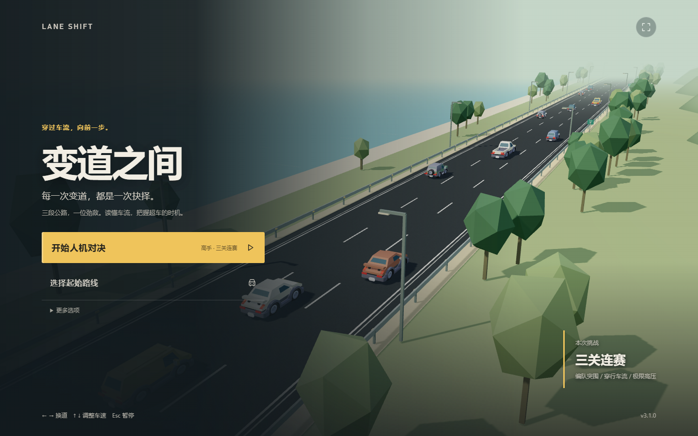
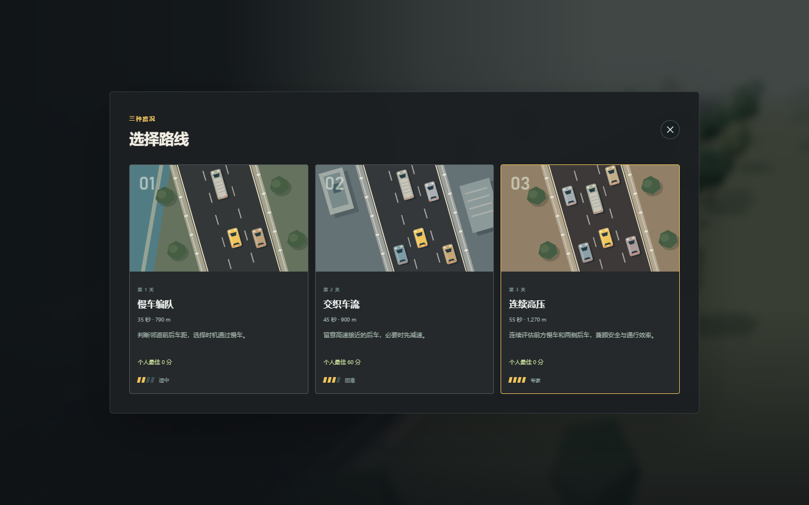
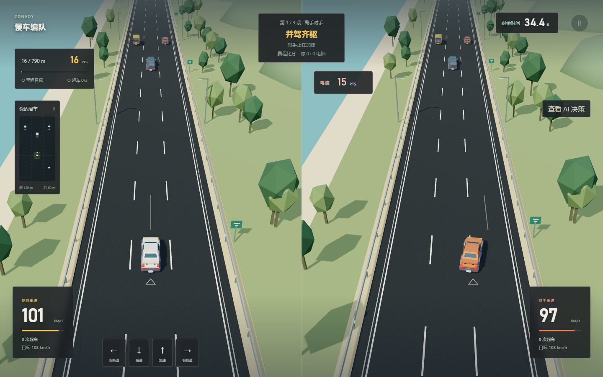

# LANE SHIFT｜变道之间

一个以强化学习为核心的三人课程项目：玩家与本地训练的 AI 在相同初始车流下分别驾驶，比较安全完赛、里程和超车成绩。游戏可离线运行；展示时无需重新训练，也不依赖在线推理 API。



## 启动

已配置过的 Windows 电脑直接双击 **`Start-Game.cmd`**。启动器自动检查代码版本、重建有修改的前端，并打开匹配的服务。默认地址是 `http://127.0.0.1:8765/`；若旧服务占用端口，会自动选择其他端口，请使用启动器新打开的窗口。`Check-Game.cmd` 检查依赖、构建资源、模型与评估记录。首次配置电脑时运行 `Setup-Game.cmd`。

遇到“开始无反应”或“选关空白”，请重新运行启动器。旧版服务与新版界面混用是已修复的原因；新版界面会明确提示版本不匹配。

命令行方式：

```powershell
.\.venv\Scripts\python.exe -m server.launch
```

## 课堂演示

启动后点击 **“开始人机对决”**，依次挑战慢车编队、交织车流、连续高压三段路况，实际驾驶时长共 135 秒，另有倒计时和结算。每段结束后点击“继续下一段”，赛程累计双方胜场，胜场相同则打平。正式对手始终是同一个高手 PPO，没有低难度档位或其他算法的驾驶入口。主入口使用开发种子 531124，方便现场复现。

时间较短时，点击 **“选择起始路线”**，默认从连续高压出发，只进行一局 55 秒比赛。选择慢车编队则从第一段开始，选择交织车流则进行剩余两段。选关入口使用随机车流；每段内玩家与 AI 的初始车辆完全一致。玩家按方向键换道、调速，点击“查看 AI 决策”可展开实际 PPO 输出。

结算展示双方安全完赛、里程、超车、危险跟车时间与平均车速。点击关键时刻可以从真实事件之前 3 秒回看，退出回放会返回原结算，赛程战绩保留。重试本段保留种子且不重复累计胜场；“换一组车流”更换当前路况的随机种子，保留此前赛程成绩。

**“更多选项 → 训练成果”** 首屏明确展示正式对手 PPO 的检查点、模型哈希、独立评估和选用理由。PPO 候选、DQN、A2C 仅作为训练实验对照，用来讨论安全与效率，不在比赛中轮流接管车辆。演示时可以先玩，再用这页回答“怎么训练、为什么用这个模型”。

启动器会自动重建修改后的前端，也可手动构建：

```powershell
cd web
npm ci
npm run build
cd ..
.\Start-Game.cmd
```

推荐 Python 3.12 和 Node.js 24。游戏附带构建好的 `web/dist`，正常启动时无需安装 Node.js；新电脑安装 Python 依赖需要联网。启动器优先打开 Edge 应用窗口，也可以用普通浏览器访问本地地址。

## 核心玩法

主菜单的 **开始人机对决** 进入高手挑战，也可先选择起始路线。玩家用方向键或 WASD 换道、加减速：左右点按换道，上下按住可连续调速，也可使用屏幕按钮；`Esc` 暂停。胜负依次比较安全完赛、里程达标、得分。双方使用相同的初始随机种子，交通在各自驾驶过程中独立响应各自的动作，因此是公平起点的双世界比赛，不是同一条路上的实体碰撞竞速。

三条新版关卡分别考验不同决策：

- **慢车编队**：主车道出现低速货车，寻找邻道超车窗口；35 秒，目标 790 米。
- **交织车流**：邻道后车速度更快，需要先确认汇入空隙；45 秒，目标 900 米。
- **连续高压**：前方多车道受阻且后车接近，持续评估安全与效率；55 秒，目标 1270 米。

关卡中的慢车、邻道高速后车和连续编队按随机种子生成并持续补充。游戏界面保留高手对决、选路线、训练成果、记录回放和声音画面设置；自由驾驶、AI 观战、教程、车库、旧路线和其他对手入口已移除。历史环境与实验权重继续归档，供复现使用。



## 画面与操作

游戏使用 Three.js 三维跟车视角，一张 WebGL 画布显示双方独立的驾驶世界。车辆有跑车、轿车、SUV、厢式车和货车，按环境中的真实长宽显示；海岸、公路城区和落日路段采用不同场景、自然光照、动态阴影与雾化远景。刹车灯和转向灯响应实际行驶状态，碰撞反馈来自真实仿真。车辆位置在服务端快照间平滑插值，不改变 15 Hz 物理和 5 Hz 决策。

主菜单采用动态公路背景。训练资料收进“更多选项”，驾驶时需要才展开 AI 决策。按键和屏幕按钮即时高亮；加减速支持按住，换道不自动连发，失焦或暂停清除按住状态。“减少动态效果”可固定镜头并关闭碰撞粒子。浏览器需要支持 WebGL 2，所有车型和纹理均随项目本地提供。



## 强化学习设计

新版挑战环境见 [`driving_env_v3.py`](rl_course/driving_env_v3.py)，基于 Farama HighwayEnv。玩家和 AI 共享相同的物理规则：物理仿真 15 Hz，决策 5 Hz；动作包括左换道、保持、右换道、加速、减速。目标速度档位为 12、18、24、30 m/s。神经网络输入是 30 维归一化状态，覆盖本车速度、车道、目标速度、剩余时间，以及三条车道最近前后车的距离、相对速度与侧向运动。环境会持续补充有结构的车流编队，避免仅靠开局随机车辆决定整局难度。

训练奖励包含前进、有效超车与安全完赛，并惩罚碰撞、危险跟车、短时间反复换道和在邻道有接近车辆时贸然换道。AI 推理时直接执行网络输出的五个动作，没有隐形的安全控制器代替网络修改驾驶选择。背景交通由 HighwayEnv 的车辆模型驱动。基础检查点记录在 [`deployment.json`](artifacts/experiments_v3/deployment.json)，本轮发布覆盖及实际算法、来源、步数、哈希见 [`iteration_4/release.json`](artifacts/experiments_v3/iteration_4/release.json)。历史权重保留，可核对前后结果。

实验记录位于 [`artifacts/experiments_v3/`](artifacts/experiments_v3/)。前期比较了旧版模型迁移、规则示范初始化及从零 PPO；本轮在相同 v3.1 关卡上重新训练了 PPO、DQN、A2C。PPO 继续微调；DQN 先从零训练再继续训练；A2C 同时试验从零训练和 PPO 权重初始化后做 A2C 更新。每种方法的配置、检查点和开发曲线均保存在 [`iteration_4/`](artifacts/experiments_v3/iteration_4/)。初始化和训练预算不同，因此不能将结果解释成算法本身的普遍优劣。规则驾驶仍是独立基线，正式模型对决不会调用规则替网络行动。旧版环境实验保留在 [`artifacts/experiments_v2/`](artifacts/experiments_v2/)。

针对保守减速，本轮训练每前进一米额外奖励 0.035、每超车一次额外奖励 0.2，并把碰撞总惩罚提高至 -60；训练路况按 20% 编队、40% 交织、40% 高压抽样。正式游戏的物理、计分、最高与最低速度完全一致，玩家没有额外限制。较早的效率实验 [`demo_efficiency_s62/`](artifacts/experiments_v3/demo_efficiency_s62/) 曾出现“得分提高、碰撞也增加”，因此本轮替换高手的门槛要求达标率和得分同时提高、碰撞不增加。

## 如何看实验结果

检查点先在开发集筛选，再用另一组 96 条开发道路复核，并将候选与高手选择写入不可重复覆盖的 [`selection.json`](artifacts/experiments_v3/iteration_4/selection.json)。冻结后每个模型使用三条真实关卡、每条 100 个未见种子（1631100–1631199）测试，对比碰撞、安全达标、超车、分数及同起点胜负。当前完整报告见 [`iteration_4/report.json`](artifacts/experiments_v3/iteration_4/report.json)，同目录 `test_*.json` 保存逐局结果。`algorithm_comparison.png`、`paired_game_outcomes.png`、`learning_curves.png` 可用于 PPT；游戏内的结果页使用同一份经过哈希校验的报告。

这些结果说明模型在指定环境和测试种子上的表现，不等于“普遍超过人类”。项目没有采集足以支持这种结论的人类基准数据。三人展示时可以让一位同学实际驾驶，让一位同学解释环境与训练，让一位同学展示评估、消融和局限。

前一版测试报告保留在 [`evaluation_final/report.json`](artifacts/experiments_v3/evaluation_final/report.json)。其中原高手达标率 71.7%、碰撞 4/300，使用的是另一组道路；不要直接拿这些历史数字与本轮新道路结果计算提升。本轮报告的 `improvement` 对旧高手和新候选在同一组新道路上的表现作比较。

本轮 700,816 步新增训练后的冻结测试结果：PPO 候选达标率 78.3%、碰撞 8/300；DQN 为 56.7%、65/300；A2C 为 79.0%、5/300。同场测试的原高手 PPO 为 72.3%、0/300，因此 A2C 提高了达标率，却没有通过“碰撞不增加”的升级门槛，正式高手继续使用原 PPO。这三个候选保留在训练成果的实验对照页。连续高压关更难：原高手 32% 达标且零碰撞，A2C 43% 达标、4/100 碰撞。这个结果展示了效率奖励与安全约束的实际取舍，不能只凭总达标率宣布训练全面成功。

当前正式权重为 `v3_expert`，来源 `safe_transfer_s47`，选用该次训练的 **175,000 步检查点**（完整训练记录为 501,760 步），文件为 `artifacts/experiments_v3/deployment/v3_expert-b4f0d5f66de4.zip`。选中的检查点步数与完整训练预算是两个不同数字。

按游戏的同种子胜负规则，A2C 候选对原高手为 **217 胜、72 负、11 平**，已部署高手对规则驾驶为 **228 胜、71 负、1 平**。胜负统计和碰撞统计回答不同问题，因此两者同时保留。

## 复现与项目结构

无需训练即可玩交付版。若要新开实验，使用不同的运行名称，避免覆盖归档结果：

```powershell
.\.venv\Scripts\python.exe -m rl_course.train_v3 --run my_new_run --seed 13 --steps 200000
.\.venv\Scripts\python.exe -m rl_course.evaluate_v3 --policy rule --episodes 80 --game-routes
.\.venv\Scripts\python.exe -m rl_course.evaluate_v3 --policy my_candidate --model artifacts/experiments_v3/my_new_run/best.zip --episodes 80 --game-routes
```

`--split test` 保留给最终冻结模型后的独立评估，不应用来反复挑检查点。已有实验的配置、训练进度、检查点选择和测试记录随项目归档。示范数据可运行 `python -m rl_course.demonstrations_v3` 重新采集；数据采集量与 PPO 环境交互步数分别记录。

本轮多算法训练入口为 `rl_course.train_challenge_models`（用 `--help` 查看参数），流程为开发验证 → 扩大开发集复核 → 锁定候选 → 新道路独立测试 → 核对升级门槛。`rl_course.release_challenge_models` 实现这三段发布流程；当前 `selection.json` 已冻结，程序会拒绝重复选模覆盖它。`python -m rl_course.figures_challenge_models` 可从已发布报告重新导出汇报图。

- [`rl_course/`](rl_course/)：环境、规则、训练、评估、模型冻结及作图。
- [`server/`](server/)：本地 FastAPI 服务、对决会话、模型校验、存档回放与启动器。
- [`web/src/game/`](web/src/game/)：React、TypeScript、Three.js 三维游戏界面与 Web Audio 音效。
- [`tests/`](tests/) 与 [`web/e2e/`](web/e2e/)：环境、服务、交互和真实浏览器验证。
- [`PROJECT_PLAN.md`](PROJECT_PLAN.md)：设计路线、三人分工和汇报结构。

验证：

```powershell
.\.venv\Scripts\python.exe -m unittest discover -s tests -v
cd web
npm test
npm run lint
npm run build
npx playwright test
```

课堂展示直接启动本项目目录即可。

## 开源来源

交通仿真基于 [HighwayEnv](https://github.com/Farama-Foundation/HighwayEnv)，强化学习基于 [Stable-Baselines3](https://github.com/DLR-RM/stable-baselines3)，正式游戏渲染使用 [Three.js](https://threejs.org/)。车辆模型来自 [Kenney Car Kit](https://kenney.nl/assets/car-kit)，使用 CC0 许可；原始许可证与素材说明见 [`web/public/models/`](web/public/models/)。道路、场景、灯光、反馈与菜单由本项目实现。历史实验页面的 PixiJS 视图仍保留为归档。
