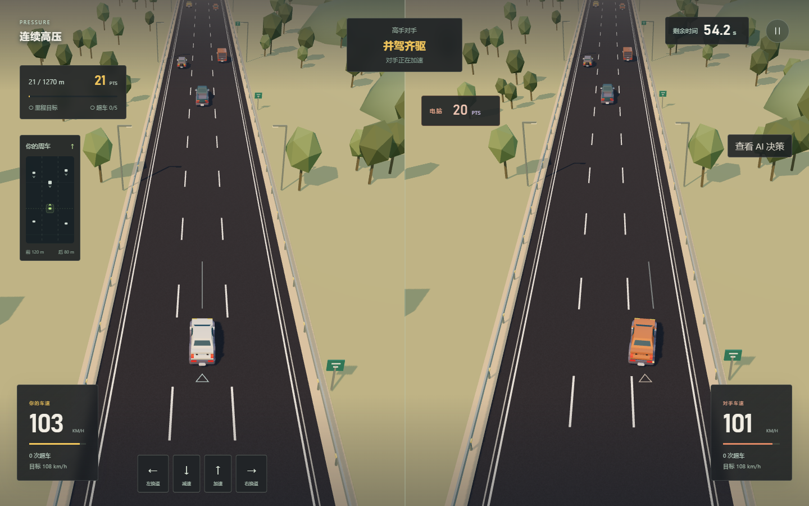

# LANE SHIFT · 变道之间

LANE SHIFT 是一个强化学习驾驶游戏，基于 HighwayEnv、Stable-Baselines3 和 Three.js。玩家与 PPO 驾驶策略从相同初始车流出发，完成三段限时行程。胜负依次比较安全完赛、里程达标和得分。

模型在本地训练和推理。仓库包含可运行的前端、模型权重及评估记录，安装依赖后可以离线使用。



## 运行

Windows，Python 3.12：

```powershell
git clone https://github.com/zhouxinlin-zz/RL-Homework.git
cd RL-Homework
.\Setup-Game.cmd
.\Start-Game.cmd
```

已安装过依赖，直接双击 `Start-Game.cmd`。启动器会打开浏览器，默认地址为 `http://127.0.0.1:8765/`。如果端口被旧服务占用，会自动选择其他端口，请使用新打开的窗口。

- `Setup-Game.cmd`：首次安装 Python 依赖，需要联网。
- `Start-Game.cmd`：检查版本并启动游戏。
- `Check-Game.cmd`：检查依赖、构建文件、模型及评估记录。

仓库内的 `web/dist` 可直接运行。只有修改前端时才需要 Node.js，建议使用 24 版本。

## 操作

- **开始人机对决**：慢车编队、交织车流、连续高压，共 135 秒驾驶时间。
- **选择起始路线**：可从任意一关开始；连续高压为单局 55 秒。
- **方向键 / WASD**：左右点按换道，上下按住调速；`Esc` 暂停。
- **查看 AI 决策**：显示当前模型的动作概率。
- **更多选项**：训练成果、驾驶记录、声音与画面设置。

双方使用相同物理规则，目标速度档位为 43.2、64.8、86.4、108 km/h。车流在两侧分别响应驾驶动作。三关连赛使用固定开发种子，选关使用随机车流；重试本段保留原种子。

切换窗口会暂停比赛或回放。图形加载失败时可以重试画面，恢复后手动继续比赛。

## 模型

正式对手为 `v3_expert` PPO，输入 30 维车辆状态，输出换道、保持和调速五种动作，每秒决策 5 次。游戏过程中不更新模型。

当前独立测试每个策略 300 局：正式 PPO 达标率 72.3%，碰撞 0/300；规则基线达标率 63.3%，碰撞 0/300。A2C 候选达标率 79.0%，碰撞 5/300，未满足“碰撞不增加”的替换条件。DQN 和其他候选的完整结果见[训练与评估](docs/training.md)。

最难的高压关中，正式 PPO 达标率为 32%。目前测试限于三车道直路仿真，尚无人类驾驶统计基准。

## 文档

- [训练与评估](docs/training.md)：状态、奖励、网络配置、训练来源、选模流程和实验结果。
- [程序结构](docs/architecture.md)：前后端接口、会话、渲染和存档。
- [前端开发](web/README.md)：开发服务、构建和测试命令。
- [答辩幻灯片](docs/defense/LANE-SHIFT-defense.html)、[逐页讲稿](docs/defense/defense-notes.html)：包含完整与精简两种播放顺序及对应讲稿。
- [5 分钟 PDF](docs/defense/LANE-SHIFT-defense-brief.pdf)：8 页重点内容，含约 20 秒实机演示时间。
- [完整 PDF](docs/defense/LANE-SHIFT-defense.pdf)：12 页正文和 2 页备答，约 8–10 分钟。

幻灯片用浏览器打开，左右键翻页，`F` 全屏，`Esc` 打开目录并选择汇报时长。精简模式会按顺序跳过补充页；答问时可以切回完整版本。

## 开发

```powershell
# 后端检查
.\.venv\Scripts\python.exe -m unittest discover -s tests -v

# 前端检查与构建
cd web
npm ci
npm test
npm run lint
npm run build
npx playwright test
```

训练代码在 `rl_course/`，本地服务在 `server/`，游戏界面在 `web/src/game/`。安装依赖、构建或更改代码后，重新运行启动器即可。

`artifacts/experiments_v2/` 和 `artifacts/experiments_v3/` 保留模型来源及逐局测试记录。个人驾驶记录、日志、训练回放缓冲区和测试截图不提交到 Git。浏览器测试输出位于 `artifacts/browser-tests/` 和 `artifacts/browser-previews/`。

## 依赖与素材

交通仿真使用 [HighwayEnv](https://highway-env.farama.org/)，算法使用 [Stable-Baselines3](https://github.com/DLR-RM/stable-baselines3)，渲染使用 [Three.js](https://threejs.org/)。车辆模型来自 [Kenney Car Kit](https://kenney.nl/assets/car-kit)，采用 CC0 许可，见[素材说明](web/public/models/ASSET_CREDITS.md)。
