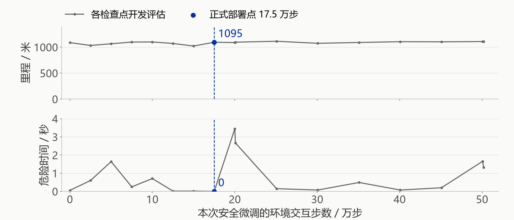

# 训练与评估

环境版本为 v3.1。游戏加载 `v3_expert` PPO 权重。多算法实验、效率微调、跟车安全微调分别保存在 `iteration_4`、`iteration_5`、`iteration_6`。各轮使用不同测试道路，成绩分别列出；正式对手由最新发布清单确定。

## 环境

环境基于 HighwayEnv，增加结构化交通编队、持续补车、风险反馈与关卡目标。物理仿真 **15 Hz**，模型每秒决策 **5 次**。

- **慢车编队**：前方慢车与邻道不同速度的车队；35 秒，目标 790 米。
- **交织车流**：前方慢车与邻道快速接近的后车；45 秒，目标 900 米。
- **连续高压**：多车道受阻与持续接近的后车；55 秒，目标 1270 米。

观察、动作和交通机制见 [基础环境](../rl_course/driving_env.py)、[挑战环境](../rl_course/driving_env_v3.py)。Three.js 呈现仿真快照，插值只改善显示，不改变碰撞和决策规则。

## 状态与动作

模型读取 **30 维归一化数值状态**，不读取游戏截图：

1. **本车 6 维**：实际速度、目标速度、横向位置、目标车道、航向、剩余时间比例。
2. **每条车道 8 维 × 3**：最近前车的距离 / 相对速度 / 是否存在，最近后车的同类信息，以及前后车各自的横向速度。

前车观测范围 120 米、后车 80 米，数值归一化并裁剪至 `[-1, 1]`。正式 PPO 的策略分支和价值分支各有两层 128 单元隐藏层。策略输出 **左换道、保持、右换道、加速、减速**五种动作概率；价值分支辅助训练，估计未来累计回报。

游戏加载固定权重做确定性推理，不在线更新参数。换道与目标速度由仿真底层控制器执行；没有额外的安全策略替神经网络修改高层选择。背景车辆使用 HighwayEnv 交通模型。

“保持”表示维持当前目标车道与目标速度档位，实际车速仍可能向目标速度变化；因此接近慢车时持续选择保持，也可能继续加速。

## 奖励函数

原正式高手所用的 v3.1 安全奖励，每次决策后计算：

```text
正向反馈：+0.025 × 新增行驶米数，+0.4 × 新增有效超车次数
安全完赛：+3
风险反馈：危险跟车每步 -0.12，不安全换道请求 -2
换道成本：每次实际改变目标车道 -0.02，短时间反向换道额外 -0.12
事故终止：碰撞或驶离道路的惩罚项合计 -30
```

事故发生时可能叠加其他奖励项，`-30` 指事故惩罚项，不是整步奖励必然等于 -30。

为改善保守减速，`iteration_4` 候选训练在**未碰撞且仍在道路上时**额外增加每米 `+0.035`、每次超车 `+0.2`，包括安全完赛的最后一步；事故惩罚项提高为 `-60`。该轮保留使用原奖励的 PPO。后续两轮奖励见下文。各组模型使用相同的速度范围、物理规则和游戏计分。

## 计分与胜负

- **训练奖励**更新网络，帮助策略学习长期取舍。
- **游戏得分**约为 `里程 + 35×超车 + 300×完赛 - 250×失败 - 5×危险秒数`，取整且不低于零。结算将未安全完赛的终止视为失败。
- **里程达标**要求安全完成整段且达到目标里程；超车目标影响星级，不是里程达标的必要条件。
- **对决胜负**先比较安全完赛，再比较达标，最后比较得分，避免临近终点撞车仍靠前期里程获胜。

具体定义见 [game_rules.py](../rl_course/game_rules.py)。

## 训练配置

### 原正式 PPO：微调起点

来源链为 `v2/cal_rl_s47 → v3/transfer_s47 → v3.1/safe_transfer_s47`，包含上游预训练。最后一段使用 4 个向量化环境，在 CPU 上收集经验；课程采样从偏重慢车编队过渡到三种路况近似均匀，训练回合统一为 45 秒。

每个环境收集 512 步，共 2048 条交互后进行一轮 PPO 更新；每批 256 条，重复优化 8 个 epoch。正式权重记录：学习率 `3e-4`、折扣率 `0.99`、GAE 系数 `0.95`、熵系数 `0.008`、裁剪系数 `0.2`。PPO 通过新旧策略概率比的裁剪目标限制过大的策略更新。

训练期间定期在开发道路上评估，保存权重和指标。`safe_transfer_s47` 完整记录为 **501,760 环境交互步**，正式模型选用其中 **175,000 步检查点**。步数是向量环境中的交互总数，不是回合数；整批采样可能使实际步数略超请求步数。更晚的检查点不保证更好。

证据：[初始配置](../artifacts/experiments_v3/safe_transfer_s47/config.json)、[完整进度](../artifacts/experiments_v3/safe_transfer_s47/progress.json)、[训练实现](../rl_course/train_v3.py)。续训后的累计请求和实际步数以 `progress.json` 为准，初始配置记录第一次运行设置。

### 上游模型的开发评估曲线



曲线来自 `safe_transfer_s47/progress.json` 的 17 次评估，保留原始记录点、不做平滑。每点为相同的 24 局开发道路（三种路况各 8 个种子 `531100–531107`），回合统一 45 秒。蓝线标出 175,000 步的部署检查点；横轴零点已经继承上游 PPO 权重。

上图为平均行驶里程，下图为每局累计危险时间，后者不是碰撞率。部署点的平均里程为 1095.0 米、危险时间为 0 秒；最终检查点为 1106.9 米、1.32 秒。继续训练会改变效率与风险表现。这些是单次训练的开发评估，不是后文实际关卡时长下的 300 局独立测试，也不代表多个训练种子的置信区间。

### PPO、DQN 与 A2C 候选

候选使用相同观测与动作，按慢车编队 / 交织 / 高压 **20% / 40% / 40%** 抽样，采用各关实际 35 / 45 / 55 秒时长及上述效率奖励。

- **PPO 微调**：从正式高手继续训练 200,704 步，选中 25,000 步候选。学习率降至 `5e-5`。
- **DQN**：从零运行 125,008 步，再从其 125,000 步检查点继续 200,000 步，选中续训的 200,000 步权重。通过经验回放和目标网络学习动作价值。
- **A2C**：从零运行 125,056 步；另将 PPO 网络权重初始化到 A2C 后运行 50,048 步，选中迁移分支的 50,000 步检查点。初始化复制策略和价值网络，后续按 A2C 更新。

五次运行合计 **700,816 步新增交互**，不含上游预训练。各组初始化和预算不同，比较结果适用于这些具体配置。

配置、开发曲线与权重见 [iteration_4](../artifacts/experiments_v3/iteration_4/)，实现见 [train_challenge_models.py](../rl_course/train_challenge_models.py)。

## 上一轮选模与测试（iteration_4）

1. **训练中验证**：每关 12 个开发种子 `631100–631111`，观察训练并初筛检查点。
2. **扩大开发集复核**：每关 32 个种子 `631200–631231`，共 96 局，按碰撞更少、达标更高、得分更高挑选。
3. **冻结选择**：将各算法检查点和高手候选写入 [selection.json](../artifacts/experiments_v3/iteration_4/selection.json)，记录路径与 SHA-256，拒绝重复覆盖。
4. **独立测试验收**：每关 100 个未见种子 `1631100–1631199`，每策略 300 局；含归档对手共 7 个策略、2100 局，使用相同初始道路，保存逐局结果。
5. **发布检查**：核对测试覆盖、模型和报告哈希。候选只有达标率与均分均提高、碰撞不增加才升级。测试用于此次发布的通过 / 不通过验收，不回头挑另一个检查点。

后续实验需使用新测试种子。原高手的开发种子与候选训练不同，分别记录在对应运行目录。

## 上一轮结果（iteration_4）

以下统一引用 [iteration_4/report.json](../artifacts/experiments_v3/iteration_4/report.json)，**每项均为同一组 300 局**：

- **正式 PPO**：达标率 **72.3%**，碰撞 **0/300**。
- **PPO 候选**：达标率 **78.3%**，碰撞 **8/300**。
- **DQN 候选**：达标率 **56.7%**，碰撞 **65/300**。
- **A2C 候选**：达标率 **79.0%**，碰撞 **5/300**。
- **规则驾驶**：达标率 **63.3%**，碰撞 **0/300**。

正式 PPO 对规则驾驶，按游戏胜负规则同起点比较为 **228 胜、71 负、1 平**。A2C 对正式 PPO 为 **217 胜、72 负、11 平**，但碰撞增加，未通过预设安全门槛，所以仍部署 PPO。效率改善同时暴露了安全代价。

连续高压关是主要失败场景：正式 PPO 达标 **32/100**、碰撞 **0/100**；A2C 达标 **43/100**、碰撞 **4/100**。有限测试中未观测到碰撞，仍不能保证其他道路同样安全。

该轮保留的权重为 `artifacts/experiments_v3/deployment/v3_expert-b4f0d5f66de4.zip`；发布结论见 [release.json](../artifacts/experiments_v3/iteration_4/release.json)。更早测试使用不同道路，保留作历史记录，不与本轮直接计算提升。

按高压关的原始逐局记录拆分：

- 正式 PPO：32 局达标，68 局安全完赛但里程不足，0 局碰撞。这 68 局距离 1270 米目标的缺口中位数为 **19.4 米**。
- A2C 候选：43 局达标，53 局安全完赛但里程不足，4 局碰撞。

来源：[正式 PPO 逐局记录](../artifacts/experiments_v3/iteration_4/test_v3_expert.json)、[A2C 逐局记录](../artifacts/experiments_v3/iteration_4/test_v3_a2c_candidate.json)。生成幻灯片时会核对每组种子、分类总数和冻结报告。统计说明当前失败主要集中在通行效率，具体原因仍需结合回放分析；后续实验继续使用原有关卡目标，并采用新的未见道路验收。

测试仅覆盖三车道直路仿真。AI 读取结构化状态，人类看画面，输入形式不同；目前没有系统人类基准，也未开展多训练随机种子的显著性分析。这些结果尚不能用于判断人类驾驶水平或真实道路性能。

## 效率微调（iteration_5）

上一轮分析暴露了高压关里程不足的问题。本轮从原正式 PPO 的策略与价值网络初始化，重新建立优化器，并明确设置各组训练种子；不增加运行时规则接管。

- **训练任务匹配游戏**：回合改为实际的 35 / 45 / 55 秒。慢车编队、交织车流、高压车流按 20% / 20% / 60% 采样。
- **奖励**：在 v3.1 基础上，未碰撞且仍在道路上时每米额外 +0.015；安全完赛并达到原里程目标额外 +6；事故惩罚项合计 -60。
- **控制更新幅度**：裁剪范围 0.08，近似 KL 上限 0.01，4 个 epoch，熵系数 0.001。每次仍采集 4 × 512 条交互，小批量为 256；折扣率 0.99、GAE 0.95。
- **三组开发运行**：种子 91 / 学习率 1e-5，种子 103 / 2e-5，各请求 120,000 步；种子 127 / 5e-5，请求 180,000 步。第三组用于进一步检查前两组较小更新后的效率瓶颈。种子与学习率同时改变，因此这不是单因素消融实验。
- **发布条件**：整体达标率和均分都提高；整体及每关碰撞不增加；每关达标率不下降。只升级完整满足条件的冻结候选。

训练环境只改变奖励与路线采样。测试逐步比较相同种子、相同动作下的训练环境与游戏环境，验证观测、车辆轨迹、终止条件一致。

开发曲线每点为 24 局：每关种子 `741100–741107`。每组取两个开发表现最好的检查点，在另一组 96 局（每关 `741200–741231`）复核后冻结一个候选。之后，原 PPO、候选与规则基线分别运行同一组 300 局新测试道路（每关 `1741100–1741199`）。测试不参与检查点再选择。

该轮保存三关的双屏回放：左侧原 PPO、右侧冻结候选。每关使用预先固定的开发种子 `741203`，不按谁获胜挑选片段。游戏界面显示最近一轮完成的实验；回放不写入玩家成绩，整组测试数据才用于判断模型是否改进。

实现：[训练](../rl_course/train_refinement.py)、[冻结与发布](../rl_course/release_refinement.py)。配置、开发曲线、逐局报告和模型权重保存在 [iteration_5](../artifacts/experiments_v3/iteration_5/)。

三组实际运行合计 **421,888 步**，冻结 `ppo_s91` 的 **114,688 步**检查点。该组完整训练为 120,832 步。独立测试结果：原 PPO 达标 **70.0%**、碰撞 **5/300**；候选达标 **76.7%**、碰撞 **4/300**；规则基线达标 **65.0%**、碰撞 **0/300**。高压关达标从 **27%** 提高到 **38%**，但碰撞由 **0/100** 增加至 **1/100**，未通过每关碰撞不增加的条件，**本轮不替换正式对手**。

发生追尾的道路种子为 `1741107`。回放显示候选在第 29.2 秒前车间距约 7.49 米、预计碰撞时间约 1.28 秒时仍选择保持；随后一度减速，又在很小车距下加速，于 31.4 秒追尾。原 PPO 在同一道路安全完成。这一案例用于设计下一轮跟车约束；后续验收更换测试道路。

## 跟车安全微调（iteration_6）

从 `iteration_5` 的冻结效率权重继续训练，保留原 PPO 为固定参考网络。训练中对当前批次接近前车的状态增加策略分布约束，减少效率微调对原有跟车行为的破坏。

- 延续实际赛程、20% / 20% / 60% 路况采样及效率奖励；危险跟车每步额外惩罚 **0.25**。
- 每轮执行标准 PPO 更新，再遍历一次当前采样，在风险状态上最小化 `λ × KL(参考策略 || 当前策略)`。参考网络冻结，只向当前策略反向传播。
- 风险状态由模型已有观测判断：当前或目标车道存在前车，且车距小于 20 米，或正在接近且预计碰撞时间小于 3.5 秒。这个条件只选择训练损失作用的样本，不修改比赛动作。
- 两组设置：种子 191 / 约束系数 0.5，种子 203 / 系数 2；各 65,536 步。学习率 `5e-6`、PPO 裁剪 `0.05`，其余采样参数沿用效率微调。权重加载完成后再初始化新 PPO 的随机种子与优化器。
- 每次开发评估使用每关 `841100–841107`；96 局选模使用 `841200–841231`；冻结后验收使用每关 `2741100–2741199`。两份权重和规则基线均面对同一组新道路。

推理仍使用标准 `PPO.load` 和单个策略网络；参考网络不写入模型文件、不参与游戏。实现见 [train_safety_refinement.py](../rl_course/train_safety_refinement.py)。参考已有策略辅助强化学习的思路与 [Kickstarting Deep Reinforcement Learning](https://arxiv.org/abs/1803.03835) 相关；这里采用的是局部状态上的简化 KL 约束，并非复现该论文或提出新算法。PPO 裁剪和参考策略约束都不提供碰撞安全保证。

两组实际训练合计 **131,072 步**，96 局复核选出种子 203 的 **16,384 步**检查点。该组完整训练为 65,536 步，零点已继承效率微调权重。与上一轮合计 **552,960 步正式实验交互**，另有更早的预训练；这些数字不包含排查随机种子加载问题的本地调试运行。

冻结候选回访旧追尾道路 `1741107` 时安全完成 55 秒，行驶 **1312.3 米**，达到原 1270 米目标。该道路已用于失败分析，只记作[回归案例](../artifacts/experiments_v3/iteration_6/regression_case.json)，不计入新的独立测试。

游戏中的“训练成果 → 本轮微调与回放”显示这轮验收、两组未经平滑的开发曲线，以及三关双屏回放。回放固定使用开发种子 `841203`；可同时查看两边的动作概率，空格暂停、左右键逐秒查看。左侧为最初正式 PPO，右侧为经过效率和安全两阶段微调的候选；曲线横轴只统计第二阶段新增步数。

### 独立验收与部署结论

结果引用 [iteration_6/report.json](../artifacts/experiments_v3/iteration_6/report.json)，每策略 300 局：

- **原 PPO**：达标 **73.7%**，碰撞 **2/300**，平均 **1547.5 分**。
- **安全微调候选**：达标 **74.0%**，碰撞 **4/300**，平均 **1546.5 分**。
- **规则驾驶**：达标 **68.0%**，碰撞 **0/300**，平均 **1455.0 分**。

高压关达标由 35% 到 37%，双方该关均零碰撞；但慢车编队达标由 98% 降至 96%，碰撞从 2 次增至 4 次。候选没有通过整体碰撞、均分和逐关表现门槛，**保留原正式 PPO**，权重 SHA-256 为 `b4f0d5f66de4a589f240654ad21b09705beaf52eb71a4c43abe4ce5765a5419a`。

旧追尾案例通过，不代表新的道路全部改善；开发集提高也没有在独立测试中稳定复现。两阶段实验说明只增加训练量或风险惩罚不足以解决泛化问题。本项目展示完整结果和未发布原因，不用训练回报或单次回放替代整组测试。下一步若继续研究，应控制单个改动做消融，并检查道路采样覆盖与状态中的任务进度信息。

## 开发与复现

运行游戏无需重新训练。以下命令在项目根目录执行，以新名称建立基础 PPO 实验：

```powershell
.\.venv\Scripts\python.exe -m rl_course.train_v3 --run my_new_run --seed 13 --steps 200000
.\.venv\Scripts\python.exe -m rl_course.evaluate_v3 --policy rule --episodes 80 --game-routes
.\.venv\Scripts\python.exe -m rl_course.evaluate_v3 --policy my_candidate --model artifacts/experiments_v3/my_new_run/best.zip --episodes 80 --game-routes
```

该示例不会复现候选的额外效率奖励。多算法入口用 `python -m rl_course.train_challenge_models --help` 查看，选择未使用的 seed 作为新运行名。现有 `release_challenge_models` 发布目录已冻结；新一轮应配置独立输出目录和新测试种子。

## 参考

算法使用 Stable-Baselines3 实现：[PPO](https://stable-baselines3.readthedocs.io/en/master/modules/ppo.html)、[DQN](https://stable-baselines3.readthedocs.io/en/master/modules/dqn.html)、[A2C](https://stable-baselines3.readthedocs.io/en/master/modules/a2c.html)。环境基于 [HighwayEnv](https://highway-env.farama.org/)。

### 相近项目与参考做法

- [HighwayEnv](https://github.com/Farama-Foundation/HighwayEnv)：提供高速、汇入、交叉路口等驾驶任务。本项目使用它的仿真基础，并自行实现三种交通编队与持续补车。
- [RL Baselines3 Zoo](https://github.com/DLR-RM/rl-baselines3-zoo)：组织训练配置、定期评估与模型运行，并提供[训练和评估曲线脚本](https://rl-baselines3-zoo.readthedocs.io/en/master/guide/plot.html)。本轮参考其曲线展示方式，图中数据来自本项目的归档记录。
- [MetaDrive](https://github.com/metadriverse/metadrive)：使用多样化场景研究泛化，并分别记录[奖励、代价和终止结果](https://metadrive-simulator.readthedocs.io/en/latest/reward_cost_done.html)。本轮参考这种区分方式，补充安全完赛但未达标的失败分类；MetaDrive 不是本项目运行依赖。
- [HighwayEnv 课程项目](https://github.com/MysterHawk/kdg-dai6-reinforcement-learning)：组织了自定义奖励、多个算法和评估脚本，也记录了高奖励与实际驾驶效果不一致的问题。其连续动作映射和模型成绩不直接适用于当前五动作任务，因此只参考实验组织与问题分析方式。
